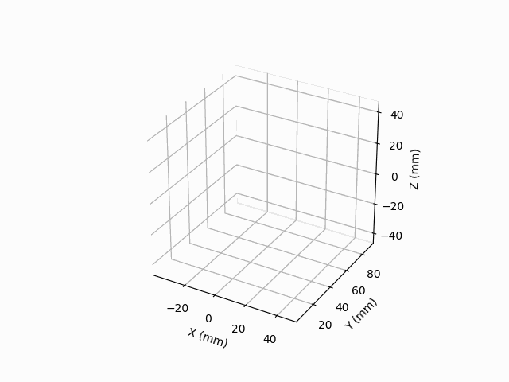

# gcody

Gcody is a python wrapper for GCODE. It gives common programming language functionality to GCODE as well as some convenient debugging tools. 
This is a very early draft of gcody and it is intended for general writing of GCODE, not printer specific code. 
Gcody was heavily inspired by [mecode](https://github.com/jminardi/mecode).


### Basics:

<python code example>

```python
# gcody example creating a serpentine pattern
from gcody import gcode

# creating parameters
distance = 10
cycles = 10

# creating gcode object
g = gcode()

# writes the GCODE command to use relative coordinates
# this changes how position is recorded internally and will be displayed differently
# when g.view is called below()
# abs_coords is the default setting for gcode and is the default for gcody as well
g.rel_coords()


# setting the speed for the print head
# input is in per second units and is converted to per minute
g.speed(10, '10 mmps motion') 

# moves the print head back and forth in x
g.move(distance, com='Moves head 10 in x')


# moves the print head back and forth in x
for i in range(1,cycles):
    # simple move allows for modality (not repeating commands)
    # it makes the GCODE prettier :)
    # unfortunately not all printers support it :(
    g.simple_move(y=10) # movement in y
    g.simple_move((-1)**i * distance) # movement in x

# creates a matplotlib figure matching the path of the printer head
# defaults to a 4D plot with time represented as color
g.view() # passes pyplot.plot argument as args and kwargs

# creates a gif, passing args to pyplot.plot.
g.live_view('b',save_file='snake.gif', show=False)

# saves the GCODE to a file
g.save('snake') # outputs file 'snake.gcode'
g.save('snake','txt') # outputs file 'snake.txt'
```

The output GCODE is:
```GCODE
G91 ; use relative coordinates 
F600 ; 10 mmps motion 
G1 X10.000000 ; Moves head 10 in x 
Y10.000000  
X-10.000000  
Y10.000000  
X10.000000  
Y10.000000  
X-10.000000  
Y10.000000  
X10.000000  
Y10.000000  
X-10.000000  
Y10.000000  
X10.000000  
Y10.000000  
X-10.000000  
Y10.000000  
X10.000000  
Y10.000000  
X-10.000000  
```

<Print head image>





### Dependancies:
* [pyvector](https://github.com/rtZamb/pyvector)
* Numpy
* Matplotlib
* pillow, ImageMagic, of FFmpeg as helpers to matplotlib to save videos
	


### To Do:
* Add clockwise motion commands
* Add in other GCODE commands
* Add more complex combinations of move
* Take requests for features!


